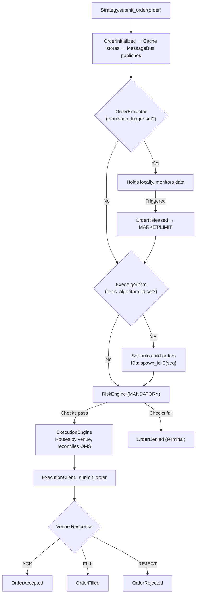
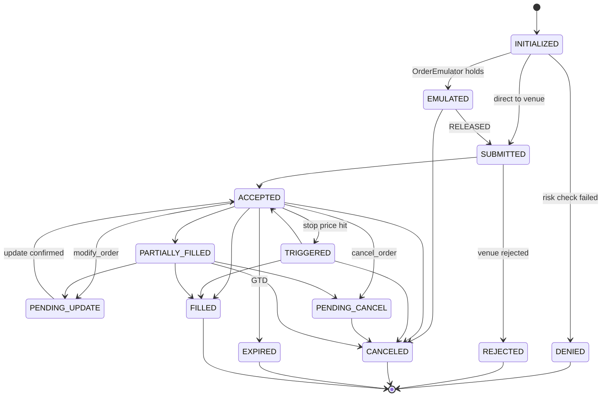
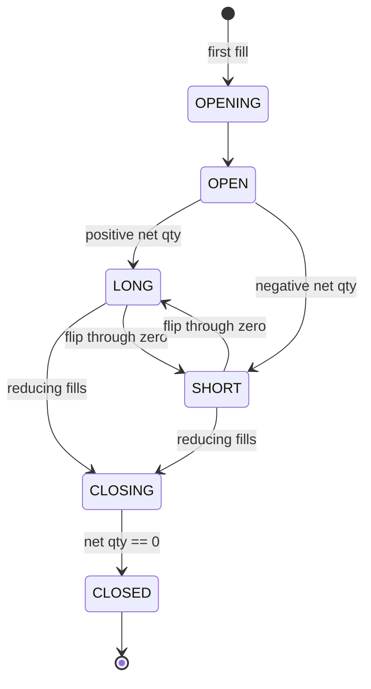

# Execution

Order lifecycle, state machine, OMS, risk engine, reconciliation, TradingNode setup, memory management, and deployment for NautilusTrader.

## Full Execution Flow



## Order State Machine



**Terminal states**: DENIED, REJECTED, CANCELED, EXPIRED, FILLED

**Order lifecycle shorthand**:
- **Market**: submit → Submitted → Accepted → Filled (possibly multiple partial fills)
- **Limit**: submit → Submitted → Accepted → (modify) → PendingUpdate → Updated → (cancel) → PendingCancel → Canceled

Partial fills are normal — a single order can produce multiple fills.

## OMS Types

### NETTING (standard for crypto)

One position per `InstrumentId`. All fills aggregate. Opposite-side fills reduce/flip.

```python
# BUY 1.0 → LONG 1.0 → BUY 0.5 → LONG 1.5 → SELL 2.0 → SHORT 0.5
```

Position ID = `InstrumentId` value.

### HEDGING

Multiple independent positions per `InstrumentId`. Each has unique `PositionId`.

```python
# BUY 1.0 → Position A: LONG 1.0
# BUY 0.5 → Position B: LONG 0.5
# SELL 1.0 (pos A) → Position A: CLOSED, Position B: LONG 0.5 (unaffected)
```

```python
class MyConfig(StrategyConfig, frozen=True):
    oms_type: OmsType = OmsType.HEDGING  # override venue default
```

When strategy `oms_type` differs from venue:
- **Strategy=HEDGING, Venue=NETTING**: Engine assigns virtual `position_id` to fills
- **Strategy=NETTING, Venue=HEDGING**: Engine overrides `position_id` to single netting position

## RiskEngine

### Pre-Trade Checks

- Price precision matches instrument
- Price > 0 (except options)
- Quantity precision and min/max bounds
- Notional within min/max bounds
- `reduce_only` validation: position exists, correct side
- Trading state check

### Trading States

| State | Behavior |
|-------|----------|
| `ACTIVE` | All commands accepted |
| `HALTED` | No new orders; cancels allowed |
| `REDUCING` | Only cancels and position-reducing orders |

### Configuration

```python
from nautilus_trader.config import RiskEngineConfig

config = RiskEngineConfig(
    bypass=False,  # NEVER bypass in production
    max_order_submit_rate="100/00:00:01",
    max_order_modify_rate="100/00:00:01",
    max_notional_per_order={"BTCUSDT-PERP.BINANCE": 1_000_000},
)
```

## Order Emulator

Emulates complex order types locally when venue doesn't support them:

| Emulated Type | How |
|---------------|-----|
| `STOP_MARKET` | Monitors market data, submits MARKET on trigger |
| `STOP_LIMIT` | Submits LIMIT on trigger |
| `TRAILING_STOP_MARKET` | Trails trigger price, submits MARKET |
| `MARKET_IF_TOUCHED` | Submits MARKET on price touch |
| `LIMIT_IF_TOUCHED` | Submits LIMIT on price touch |

```python
order = self.order_factory.stop_market(
    instrument_id=instrument_id,
    order_side=OrderSide.SELL,
    quantity=Quantity.from_int(1),
    trigger_price=Price.from_int(50000),
    trigger_type=TriggerType.LAST_PRICE,
    emulation_trigger=TriggerType.LAST_PRICE,  # emulate locally
)
```

## Execution Algorithms

### TWAP (Built-in)

```python
order = self.order_factory.market(
    instrument_id=instrument_id,
    order_side=OrderSide.BUY,
    quantity=Quantity.from_int(100),
    exec_algorithm_id=ExecAlgorithmId("TWAP"),
    exec_algorithm_params={"horizon_secs": 300, "interval_secs": 30},
)
self.submit_order(order)
```

### Custom ExecAlgorithm

```python
from nautilus_trader.execution.algorithm import ExecAlgorithm

class IcebergAlgorithm(ExecAlgorithm):
    def on_order(self, order: Order) -> None:
        display_qty = order.exec_algorithm_params.get("display_qty", 10)
        child = self.spawn_order(primary=order, quantity=Quantity.from_int(display_qty))
        self.submit_order(child)
```

**Cache queries**: `self.cache.orders_for_exec_algorithm(exec_algorithm_id)` — all orders for an algorithm. `self.cache.orders_for_exec_spawn(exec_spawn_id)` — all child orders from a spawn.

## Contingent Orders

### OTO (One-Triggers-Other)

```python
from nautilus_trader.model.orders import OrderList
from nautilus_trader.model.enums import ContingencyType

entry = self.order_factory.limit(...)
stop = self.order_factory.stop_market(..., reduce_only=True)
take = self.order_factory.limit(..., reduce_only=True)

order_list = OrderList(
    order_list_id=OrderListId("BRACKET-001"),
    orders=[entry, stop, take],
    contingency_type=ContingencyType.OTO,
)
self.submit_order_list(order_list)
```

**Preferred**: Use `order_factory.bracket()` for standard entry+SL+TP brackets.

**Attribute note**: Orders use `order.side`, events use `event.order_side`. Mixing them causes `AttributeError`.

### OCO / OUO

- **OCO**: One fills/cancels → other automatically canceled
- **OUO**: Linked bracket — filling one updates the other's quantity

## Order Events from ExecutionClient

| Method | Event | When |
|--------|-------|------|
| `generate_order_accepted()` | `OrderAccepted` | Venue acknowledges |
| `generate_order_rejected()` | `OrderRejected` | Venue rejects |
| `generate_order_filled()` | `OrderFilled` | Trade executed |
| `generate_order_canceled()` | `OrderCanceled` | Cancel confirmed |
| `generate_order_expired()` | `OrderExpired` | GTD expired |
| `generate_order_triggered()` | `OrderTriggered` | Stop triggered |
| `generate_order_updated()` | `OrderUpdated` | Modify confirmed |
| `generate_order_modify_rejected()` | `OrderModifyRejected` | Amend rejected by venue |
| `generate_order_cancel_rejected()` | `OrderCancelRejected` | Cancel rejected by venue |

All events flow: specific handler → `on_order_event()` → `on_event()` in strategy.

## Overfill and Duplicate Detection

### Overfills

```python
LiveExecEngineConfig(allow_overfills=True)  # default: False
# False: logs error, rejects fill
# True: logs warning, applies fill, tracks in order.overfill_qty
```

Causes: matching engine races, minimum lot constraints, DEX mechanics, WS replay duplicates.

### Duplicate Detection

Two-level:
1. **LiveExecutionEngine**: Pre-filters on `trade_id` alone
2. **Order model**: `is_duplicate_fill()` compares `trade_id + side + price + qty`

Exact duplicates → skipped with warning. Noisy duplicates (same trade_id, different data) → error log, rejected, no crash.

## Position Management

### Lifecycle



Position events: PositionOpened → PositionChanged (on subsequent fills) → PositionClosed.

### PnL Tracking

- `position.avg_px_open` — average entry price
- `position.avg_px_close` — average exit price
- `position.realized_pnl` — computed on close from fill history
- `position.unrealized_pnl(last_price)` — from current price vs entry
- Commission tracking accumulated from all fills

### Position Flipping (NETTING)

When a fill takes position through zero to opposite side:
1. Current position closed → realized PnL computed
2. New position opened with remaining fill qty
3. Both events generated atomically

## Portfolio API

```python
account = self.portfolio.account(Venue("BINANCE"))
account.balance_total(Currency.from_str("USDT"))
account.balance_free(Currency.from_str("USDT"))
account.balance_locked(Currency.from_str("USDT"))
self.portfolio.is_flat(instrument_id)
self.portfolio.net_position(instrument_id)
self.portfolio.unrealized_pnls(Venue("BINANCE"))
```

## TradingNode Setup

```python
import os
from nautilus_trader.config import (
    CacheConfig, DatabaseConfig, LiveDataEngineConfig, LiveExecEngineConfig,
    LoggingConfig, MessageBusConfig, TradingNodeConfig,
)
# LiveDataEngineConfig available but rarely needed (defaults are fine)
from nautilus_trader.live.node import TradingNode
from nautilus_trader.adapters.binance import (
    BINANCE, BinanceAccountType, BinanceDataClientConfig, BinanceExecClientConfig,
    BinanceLiveDataClientFactory, BinanceLiveExecClientFactory,
)
from nautilus_trader.adapters.binance.common.enums import BinanceKeyType

config = TradingNodeConfig(
    trader_id="CRYPTO-HFT-001",
    logging=LoggingConfig(log_level="INFO"),
    cache=CacheConfig(database=DatabaseConfig(type="redis", host="localhost", port=6379)),
    message_bus=MessageBusConfig(
        database=DatabaseConfig(type="redis", host="localhost", port=6379),
        use_instance_id=True,      # unique stream per instance
        streams_prefix="trader",   # stream key prefix
    ),
    exec_engine=LiveExecEngineConfig(
        reconciliation=True,
        reconciliation_lookback_mins=1440,
    ),
    data_clients={
        BINANCE: BinanceDataClientConfig(
            api_key=os.environ["BINANCE_API_KEY"],
            api_secret=os.environ["BINANCE_API_SECRET"],
            key_type=BinanceKeyType.ED25519,
            account_type=BinanceAccountType.USDT_FUTURES,
        ),
    },
    exec_clients={
        BINANCE: BinanceExecClientConfig(
            api_key=os.environ["BINANCE_API_KEY"],
            api_secret=os.environ["BINANCE_API_SECRET"],
            key_type=BinanceKeyType.ED25519,
            account_type=BinanceAccountType.USDT_FUTURES,
        ),
    },
    timeout_connection=30.0,
    timeout_reconciliation=10.0,
    timeout_portfolio=10.0,
    timeout_disconnection=10.0,
    timeout_post_stop=5.0,
)

node = TradingNode(config=config)
node.add_data_client_factory(BINANCE, BinanceLiveDataClientFactory)
node.add_exec_client_factory(BINANCE, BinanceLiveExecClientFactory)
node.trader.add_strategy(MyStrategy(my_config))
node.build()
node.run()  # blocks until shutdown signal
```

### TradingNode vs BacktestNode

| Aspect | TradingNode | BacktestNode |
|--------|-------------|--------------|
| Clock | `LiveClock` (real time) | `TestClock` (simulated) |
| Data | Real venue streams | Historical data |
| Execution | Real venue APIs | `SimulatedExchange` |
| Event loop | Async (single loop) | Synchronous |
| Constraint | One per process | Sequential runs OK |

Same `Strategy` class works in both — adapters abstract the difference.

## State Persistence

### Redis (State Recovery)

```python
CacheConfig(database=DatabaseConfig(type="redis", host="localhost", port=6379))
```

### PostgreSQL (Audit Trail)

```python
CacheConfig(database=DatabaseConfig(
    type="postgres", host="localhost", port=5432,
    username="nautilus", password="...", database="nautilus_trading",
))
```

**Persisted**: orders (full lifecycle), positions (open/closed), accounts (balances), custom state via `on_save()`/`on_load()`.

## Reconciliation

After restart or disconnection, reconcile internal state with venue: orders accepted/filled/canceled while disconnected, position changes from fills during downtime, account balance changes.

### Startup Reconciliation

1. TradingNode connects to venue
2. `LiveExecutionEngine` calls `generate_mass_status()` on each ExecutionClient
3. Engine compares venue state vs cache state
4. Discrepancies resolved: missing fills applied, status mismatches corrected

### Continuous Reconciliation

```python
LiveExecEngineConfig(
    reconciliation=True,
    reconciliation_lookback_mins=1440,           # 24h lookback on startup
    inflight_check_interval_ms=2000,             # check in-flight orders every 2s
    open_check_interval_secs=10,                 # poll open orders every 10s
    open_check_lookback_mins=60,                 # never reduce below 60
    position_check_interval_secs=30,             # position discrepancy checks
    reconciliation_startup_delay_secs=10,        # DO NOT reduce below 10
    open_check_threshold_ms=5000,                # skip recently submitted orders
    max_single_order_queries_per_cycle=10,        # rate limit queries
    single_order_query_delay_ms=100,             # delay between queries
)
```

### Order Resolution (Max Retries Exceeded)

| Current Status | Resolution | Rationale |
|----------------|------------|-----------|
| `SUBMITTED` | → `REJECTED` | No venue confirmation received |
| `PENDING_UPDATE` | → `CANCELED` | Modification unacknowledged |
| `PENDING_CANCEL` | → `CANCELED` | Cancel never confirmed |

Safety: "Not found" resolutions only in full-history mode. 5-second buffer to prevent race condition false positives.

### Required ExecutionClient Methods

```python
async def generate_order_status_report(self, command) -> OrderStatusReport | None
async def generate_order_status_reports(self, command) -> list[OrderStatusReport]
async def generate_fill_reports(self, command) -> list[FillReport]
async def generate_position_status_reports(self, command) -> list[PositionStatusReport]
async def generate_mass_status(self, lookback_mins=None) -> ExecutionMassStatus | None
```

### Key Gotchas

- `reconciliation_startup_delay_secs < 10` causes premature reconciliation
- `open_check_lookback_mins` too short → false "missing order" resolutions
- Flatten positions before restart if possible to avoid mismatch
- External orders (manual trades) during lookback window cause mismatches

## Memory Management

Long-running sessions need periodic purging:

```python
LiveExecEngineConfig(
    purge_closed_orders_interval_mins=10,
    purge_closed_orders_buffer_mins=60,
    purge_closed_positions_interval_mins=10,
    purge_closed_positions_buffer_mins=60,
    purge_account_events_interval_mins=15,
    purge_account_events_lookback_mins=60,
    purge_from_database=False,                  # True to also purge from DB
)
```

## External Order Claims

Declare instruments whose external orders (placed outside Nautilus) should be tracked:

```python
class MyConfig(StrategyConfig, frozen=True):
    instrument_id: InstrumentId
    external_order_claims: list[str] = ["BTCUSDT-PERP.BINANCE"]
```

External orders appear via `on_order_accepted`, `on_order_filled`, etc.

## Multi-Venue Trading

```python
config = TradingNodeConfig(
    data_clients={
        "BINANCE": BinanceDataClientConfig(...),
        "BYBIT": BybitDataClientConfig(...),
    },
    exec_clients={
        "BINANCE": BinanceExecClientConfig(...),
        "BYBIT": BybitExecClientConfig(...),
    },
)
```

Strategies subscribe to data from any venue and submit orders to any venue via `instrument_id` routing.

## Instrument Constraints

Loaded from the exchange at startup via InstrumentProvider:

```python
instrument = self.cache.instrument(instrument_id)
instrument.min_notional    # minimum order value
instrument.min_quantity    # minimum order size
instrument.min_price       # minimum tick price
instrument.maker_fee       # maker fee rate
instrument.taker_fee       # taker fee rate
```

Configure leverage and internal transfers via each exchange's own REST API — not managed by NautilusTrader.

**Fee verification**: `instrument.maker_fee` / `instrument.taker_fee` are loaded from the exchange. Verify against your exchange dashboard after first connection.

## Timeouts

```python
config = TradingNodeConfig(
    timeout_connection=20.0,        # seconds to connect to venues
    timeout_reconciliation=60.0,    # seconds for order/position reconciliation
    timeout_portfolio=120.0,        # seconds for portfolio initialization
    timeout_disconnection=10.0,     # seconds for graceful disconnect
    timeout_post_stop=10.0,         # seconds after stop for final cleanup
)
```

Increase `timeout_reconciliation` for accounts with many open orders. Increase `timeout_portfolio` for multi-venue setups.

## Deployment

### Standalone Script (Recommended)

```python
def main():
    config = TradingNodeConfig(...)
    node = TradingNode(config)
    node.add_data_client_factory(...)
    node.add_exec_client_factory(...)
    node.trader.add_strategy(MyStrategy(my_config))
    node.build()
    try:
        node.run()
    except KeyboardInterrupt:
        node.stop()

if __name__ == "__main__":
    main()
```

**NO Jupyter notebooks** for live trading: event loop conflicts, no signal handling, risk of accidental re-execution.

### Docker

```dockerfile
FROM python:3.12-slim
RUN pip install nautilus_trader
COPY strategies/ /app/strategies/
COPY run_trading.py /app/
WORKDIR /app
CMD ["python", "run_trading.py"]
```

## Operational Checklist

- [ ] State persistence configured (Redis or PostgreSQL)?
- [ ] Reconciliation enabled with lookback?
- [ ] Continuous reconciliation intervals set?
- [ ] Memory purge configured for long sessions?
- [ ] API keys in environment variables (not hardcoded)?
- [ ] Logging with file output? (see [operations.md](operations.md))
- [ ] Running as standalone script (not notebook)?
- [ ] Signal handling for graceful shutdown?
- [ ] Separate testnet validation before mainnet?

## Anti-Hallucination Notes

| Hallucination | Reality |
|--------------|---------|
| `order.order_side` | `order.side` — events use `event.order_side` |
| `cache.position_for_instrument(id)` | `cache.positions_open(instrument_id=id)` — returns list |
| `cache.orders_filled()` | `cache.orders_closed()` |
| `pos.signed_qty / Decimal(...)` | `signed_qty` returns float — wrap: `Decimal(str(pos.signed_qty))` |
| `RiskEngineConfig(bypass=True)` in production | NEVER bypass in production |
| `reconciliation_startup_delay_secs < 10` | Causes premature reconciliation — keep at 10+ |
| Jupyter notebooks for live trading | Event loop conflicts, no signal handling — use standalone script |
| `modify_order` auto-fallback on unsupported venues | Adapter errors — no automatic cancel+replace |
