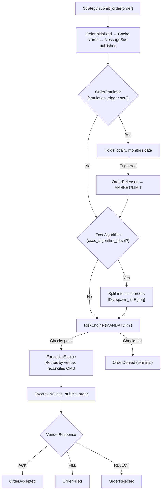
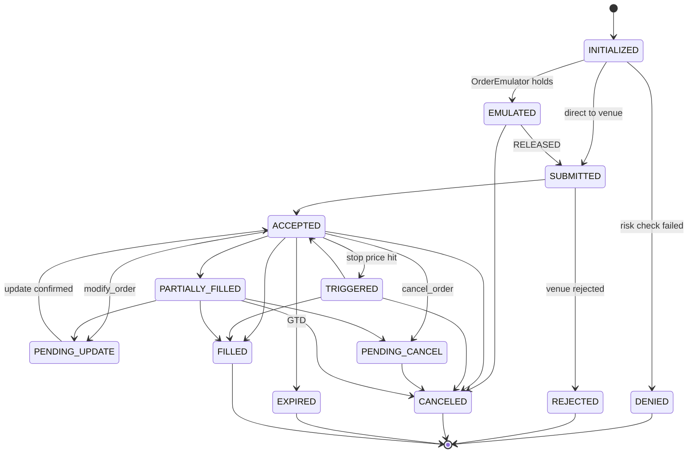
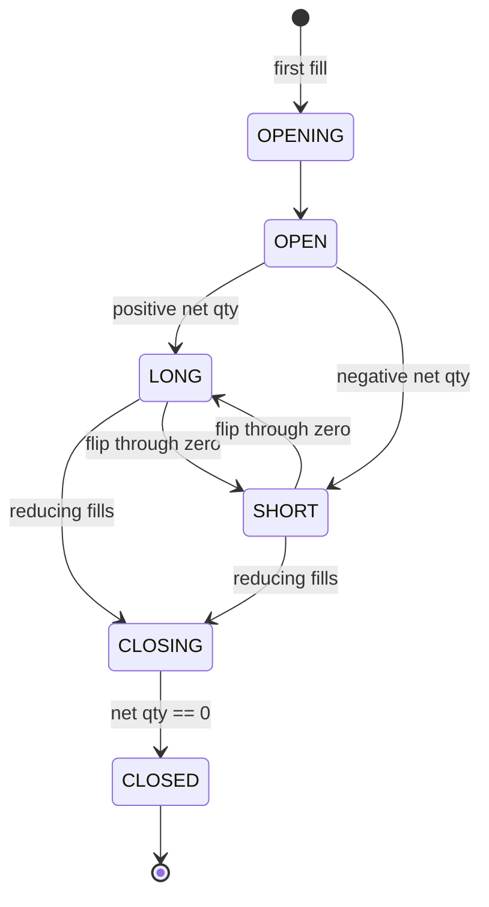

# Execution and OMS Internals

Order lifecycle, state machine, risk engine, execution algorithms, reconciliation, and position management in NautilusTrader.

## Full Execution Flow



## Order State Machine



**Terminal states**: DENIED, REJECTED, CANCELED, EXPIRED, FILLED

## OMS Types

### NETTING (standard for crypto)

One position per `InstrumentId`. All fills aggregate. Opposite-side fills reduce/flip.

```python
# BUY 1.0 → LONG 1.0 → BUY 0.5 → LONG 1.5 → SELL 2.0 → SHORT 0.5
```

Position ID = `InstrumentId` value.

### HEDGING

Multiple independent positions per `InstrumentId`. Each has unique `PositionId`. Fills don't auto-offset other positions.

```python
# BUY 1.0 → Position A: LONG 1.0
# BUY 0.5 → Position B: LONG 0.5
# SELL 1.0 (pos A) → Position A: CLOSED, Position B: LONG 0.5 (unaffected)
```

### OMS Type Mismatch

When strategy `oms_type` differs from venue:

- **Strategy=HEDGING, Venue=NETTING**: Engine assigns virtual `position_id` to fills. Venue sees one net position; Nautilus tracks multiple.
- **Strategy=NETTING, Venue=HEDGING**: Engine overrides `position_id` to use single netting position.

```python
class MyConfig(StrategyConfig, frozen=True):
    oms_type: OmsType = OmsType.HEDGING  # override venue default
```

## RiskEngine

### Pre-Trade Checks

- Price precision matches instrument
- Price > 0 (except options)
- Quantity precision matches instrument
- Quantity within min/max bounds
- Notional within min/max bounds
- `reduce_only` validation: position exists, correct side
- Trading state check

### Trading States

| State | Behavior |
|-------|----------|
| `ACTIVE` | All commands accepted |
| `HALTED` | No new orders; cancels allowed |
| `REDUCING` | Only cancels and position-reducing orders |

### Configuration

```python
from nautilus_trader.config import RiskEngineConfig

config = RiskEngineConfig(
    bypass=False,  # NEVER bypass in production
    max_order_submit_rate="100/00:00:01",
    max_order_modify_rate="100/00:00:01",
    max_notional_per_order={"BTCUSDT-PERP.BINANCE": 1_000_000},
)
```

## Order Emulator

Emulates complex order types locally when venue doesn't support them:

| Emulated Type | How |
|---------------|-----|
| `STOP_MARKET` | Monitors market data, submits MARKET on trigger |
| `STOP_LIMIT` | Submits LIMIT on trigger |
| `TRAILING_STOP_MARKET` | Trails trigger price, submits MARKET |
| `MARKET_IF_TOUCHED` | Submits MARKET on price touch |
| `LIMIT_IF_TOUCHED` | Submits LIMIT on price touch |

```python
order = self.order_factory.stop_market(
    instrument_id=instrument_id,
    order_side=OrderSide.SELL,
    quantity=Quantity.from_int(1),
    trigger_price=Price.from_int(50000),
    trigger_type=TriggerType.LAST_PRICE,
    emulation_trigger=TriggerType.LAST_PRICE,  # emulate locally
)
```

## Execution Algorithms

### TWAP (Built-in)

```python
order = self.order_factory.market(
    instrument_id=instrument_id,
    order_side=OrderSide.BUY,
    quantity=Quantity.from_int(100),
    exec_algorithm_id=ExecAlgorithmId("TWAP"),
    exec_algorithm_params={"horizon_secs": 300, "interval_secs": 30},
)
self.submit_order(order)
# Splits into ~10 child orders, one every 30s over 5 minutes
```

### Custom ExecAlgorithm

```python
from nautilus_trader.execution.algorithm import ExecAlgorithm

class IcebergAlgorithm(ExecAlgorithm):
    def on_order(self, order: Order) -> None:
        display_qty = order.exec_algorithm_params.get("display_qty", 10)
        child = self.spawn_order(primary=order, quantity=Quantity.from_int(display_qty))
        self.submit_order(child)

    def on_order_filled(self, event: OrderFilled) -> None:
        # Child filled — spawn next slice if primary not complete
        pass
```

Cache queries: `self.cache.orders_for_exec_algorithm(id)`, `self.cache.orders_for_exec_spawn(spawn_id)`

## Contingent Orders

### OTO (One-Triggers-Other)

```python
from nautilus_trader.model.orders import OrderList
from nautilus_trader.model.enums import ContingencyType

entry = self.order_factory.limit(...)
stop = self.order_factory.stop_market(..., reduce_only=True)
take = self.order_factory.limit(..., reduce_only=True)

order_list = OrderList(
    order_list_id=OrderListId("BRACKET-001"),
    orders=[entry, stop, take],
    contingency_type=ContingencyType.OTO,
)
self.submit_order_list(order_list)
```

**Preferred**: Use `order_factory.bracket()` for standard entry+SL+TP brackets — it handles contingency linking, tags (`ENTRY`, `STOP_LOSS`, `TAKE_PROFIT`), and ID generation automatically. See [bracket_order_backtest.py](../examples/bracket_order_backtest.py) for a runnable example.

**Attribute note**: Orders use `order.side`, events use `event.order_side`. Mixing them causes `AttributeError`.

### OCO (One-Cancels-Other)

When one fills/cancels, the other is automatically canceled.

### OUO (One-Updates-Other)

Linked bracket — filling one updates the other's quantity.

## Order Events from ExecutionClient

| Method | Event | When |
|--------|-------|------|
| `generate_order_accepted()` | `OrderAccepted` | Venue acknowledges |
| `generate_order_rejected()` | `OrderRejected` | Venue rejects |
| `generate_order_filled()` | `OrderFilled` | Trade executed |
| `generate_order_canceled()` | `OrderCanceled` | Cancel confirmed |
| `generate_order_expired()` | `OrderExpired` | GTD expired |
| `generate_order_triggered()` | `OrderTriggered` | Stop triggered |
| `generate_order_updated()` | `OrderUpdated` | Modify confirmed |
| `generate_order_modify_rejected()` | `OrderModifyRejected` | Amend rejected |
| `generate_order_cancel_rejected()` | `OrderCancelRejected` | Cancel rejected |

All events flow: specific handler → `on_order_event()` → `on_event()` in strategy.

## Overfill and Duplicate Detection

### Overfills

Cumulative fill qty exceeds order qty. Causes in crypto: matching engine races, minimum lot constraints, DEX mechanics, WS replay duplicates.

```python
LiveExecEngineConfig(allow_overfills=True)  # default: False
# False: logs error, rejects fill
# True: logs warning, applies fill, tracks in order.overfill_qty
```

### Duplicate Detection

Two-level:
1. **LiveExecutionEngine**: Pre-filters on `trade_id` alone
2. **Order model**: `is_duplicate_fill()` compares `trade_id + side + price + qty`

Exact duplicates → skipped with warning. Noisy duplicates (same trade_id, different data) → error log, rejected, no crash.

## Position Management

### Lifecycle



### PnL Tracking

- `position.avg_px_open` — average entry price
- `position.avg_px_close` — average exit price
- `position.realized_pnl` — computed on close from fill history
- `position.unrealized_pnl(last_price)` — from current price vs entry
- Commission tracking accumulated from all fills

### Position Flipping (NETTING)

When a fill takes position through zero to opposite side:
1. Current position closed → realized PnL computed
2. New position opened with remaining fill qty
3. Both events generated atomically

## Portfolio API

```python
account = self.portfolio.account(Venue("BINANCE"))
account.balance_total(Currency.from_str("USDT"))
account.balance_free(Currency.from_str("USDT"))
account.balance_locked(Currency.from_str("USDT"))
self.portfolio.is_flat(instrument_id)
self.portfolio.net_position(instrument_id)
self.portfolio.unrealized_pnls(Venue("BINANCE"))
```

## Reconciliation

### Purpose

After restart or disconnection, reconcile internal state with venue:
- Orders accepted/filled/canceled while disconnected
- Position changes from fills during downtime
- Account balance changes

### Required Client Methods

```python
async def generate_order_status_report(self, command) -> OrderStatusReport | None
async def generate_order_status_reports(self, command) -> list[OrderStatusReport]
async def generate_fill_reports(self, command) -> list[FillReport]
async def generate_position_status_reports(self, command) -> list[PositionStatusReport]
async def generate_mass_status(self, lookback_mins=None) -> ExecutionMassStatus | None
```

### Configuration

```python
LiveExecEngineConfig(
    reconciliation=True,
    reconciliation_lookback_mins=1440,  # 24 hours
)
```
