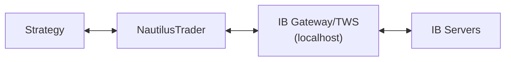

# Traditional Finance

Equity, FuturesContract, FuturesSpread, CFD, Commodity, IndexInstrument, and Interactive Brokers adapter in NautilusTrader v1.224.0.

## TradFi Instrument Types

### Equity

```python
from nautilus_trader.model.instruments import Equity
from nautilus_trader.model.identifiers import InstrumentId, Symbol
from nautilus_trader.model.objects import Currency, Price, Quantity

equity = Equity(
    instrument_id=InstrumentId.from_str("AAPL.XNAS"),
    raw_symbol=Symbol("AAPL"),
    currency=Currency.from_str("USD"),
    price_precision=2,
    price_increment=Price.from_str("0.01"),
    lot_size=Quantity.from_int(1),
    ts_event=0,
    ts_init=0,
    isin="US0378331005",                # optional — ISIN
)

# Hardcoded: size_precision=0, size_increment=1, multiplier=1, asset_class=EQUITY
equity.isin                             # "US0378331005"
```

### FuturesContract

```python
from nautilus_trader.model.instruments import FuturesContract
from nautilus_trader.model.enums import AssetClass

future = FuturesContract(
    instrument_id=InstrumentId.from_str("ESH25.GLBX"),
    raw_symbol=Symbol("ESH25"),
    asset_class=AssetClass.INDEX,
    currency=Currency.from_str("USD"),
    price_precision=2,
    price_increment=Price.from_str("0.25"),
    multiplier=Quantity.from_int(50),       # ES = $50 per point
    lot_size=Quantity.from_int(1),
    underlying="ES",
    activation_ns=0,
    expiration_ns=1742515200_000_000_000,
    ts_event=0,
    ts_init=0,
    exchange="GLBX",                        # ISO 10383 MIC (CME Globex)
)

# Hardcoded: size_precision=0, size_increment=1
future.exchange                             # "GLBX"
future.underlying                           # "ES"
future.activation_utc                       # pd.Timestamp (tz-aware UTC)
future.expiration_utc                       # pd.Timestamp (tz-aware UTC)
```

### FuturesSpread

Multi-leg futures strategies (calendar spreads, etc.).

```python
from nautilus_trader.model.instruments import FuturesSpread

spread = FuturesSpread(
    instrument_id=InstrumentId.from_str("ESH25-ESM25.GLBX"),
    raw_symbol=Symbol("ESH25-ESM25"),
    asset_class=AssetClass.INDEX,
    currency=Currency.from_str("USD"),
    price_precision=2,
    price_increment=Price.from_str("0.05"),
    multiplier=Quantity.from_int(50),
    lot_size=Quantity.from_int(1),
    underlying="ES",
    strategy_type="CALENDAR",               # required, non-empty str
    activation_ns=0,
    expiration_ns=1742515200_000_000_000,
    ts_event=0,
    ts_init=0,
    exchange="GLBX",
)

spread.legs()                               # list[tuple[InstrumentId, int]]
spread.strategy_type                        # "CALENDAR"
```

### Other TradFi Instruments

| Type | Import | Key Fields | Notes |
|------|--------|-----------|-------|
| `Cfd` | `from nautilus_trader.model.instruments import Cfd` | Standard instrument fields | Contract for difference |
| `Commodity` | `from nautilus_trader.model.instruments import Commodity` | Standard instrument fields | Physical commodity contracts |
| `IndexInstrument` | `from nautilus_trader.model.instruments import IndexInstrument` | Standard instrument fields | Index tracking instruments |

All are accessible from `nautilus_trader.model.instruments`.

## Interactive Brokers Adapter

**Requires**: `pip install nautilus_trader[ib]` (needs `ibapi` package)

### Architecture

IB connects through IB Gateway (IBG) or Trader Workstation (TWS), which acts as a local server:



### DockerizedIBGateway

Run IB Gateway in a Docker container for headless deployment:

```python
from nautilus_trader.adapters.interactive_brokers.config import DockerizedIBGatewayConfig

gateway_config = DockerizedIBGatewayConfig(
    username="...",
    password="...",
    trading_mode="paper",                   # "paper" or "live"
    read_only_api=True,                     # True = no order execution
    timeout=300,                            # seconds to wait for startup
    container_image="ghcr.io/gnzsnz/ib-gateway:stable",
    vnc_port=None,                          # set for remote desktop access
)
```

### Data Client Config

```python
from nautilus_trader.adapters.interactive_brokers.config import (
    InteractiveBrokersDataClientConfig,
    InteractiveBrokersInstrumentProviderConfig,
    SymbologyMethod,
)

data_config = InteractiveBrokersDataClientConfig(
    ibg_host="127.0.0.1",
    ibg_port=None,                          # paper: IBG=4002/TWS=7497, live: IBG=4001/TWS=7496
    ibg_client_id=1,
    use_regular_trading_hours=True,         # RTH only for bar data
    market_data_type=1,                     # 1=REALTIME, 4=DELAYED_FROZEN (no data sub needed)
    dockerized_gateway=gateway_config,      # optional
    connection_timeout=300,
    request_timeout_secs=60,                # increase for large option chains
    instrument_provider=InteractiveBrokersInstrumentProviderConfig(
        symbology_method=SymbologyMethod.IB_SIMPLIFIED,
    ),
)
```

### Execution Client Config

```python
from nautilus_trader.adapters.interactive_brokers.config import (
    InteractiveBrokersExecClientConfig,
)

exec_config = InteractiveBrokersExecClientConfig(
    ibg_host="127.0.0.1",
    ibg_port=None,
    ibg_client_id=1,
    account_id="...",
    dockerized_gateway=gateway_config,
    connection_timeout=300,
    request_timeout_secs=60,
    fetch_all_open_orders=False,            # True: reqAllOpenOrders (all clients + TWS GUI)
    track_option_exercise_from_position_update=False,
)
```

### IBContract

Define instruments using IB's contract specification:

```python
from nautilus_trader.adapters.interactive_brokers.common import IBContract

# Equity
aapl = IBContract(secType="STK", symbol="AAPL", exchange="SMART",
                  primaryExchange="ARCA", currency="USD")

# Future
es = IBContract(secType="FUT", symbol="ES", exchange="CME",
                lastTradeDateOrContractMonth="202503")

# Continuous future
es_cont = IBContract(secType="CONTFUT", symbol="ES", exchange="CME",
                     build_futures_chain=True)

# Option
aapl_call = IBContract(secType="OPT", symbol="AAPL", exchange="SMART",
                       currency="USD", lastTradeDateOrContractMonth="20250321",
                       strike=150.0, right="C")

# Forex
eur_usd = IBContract(secType="CASH", exchange="IDEALPRO",
                     symbol="EUR", currency="USD")

# Crypto
btc = IBContract(secType="CRYPTO", symbol="BTC",
                 exchange="PAXOS", currency="USD")

# Index
spx = IBContract(secType="IND", symbol="SPX", exchange="CBOE")

# Commodity
gold = IBContract(secType="CMDTY", symbol="XAUUSD", exchange="SMART")
```

### Options & Futures Chain Building

Chain flags are on `IBContract`, not the provider config:

```python
instrument_provider = InteractiveBrokersInstrumentProviderConfig(
    load_contracts=frozenset({
        # Options chain for AAPL with expiry filter
        IBContract(
            secType="IND", symbol="SPX", exchange="CBOE",
            build_options_chain=True,
            min_expiry_days=7, max_expiry_days=90,
        ),
        # Futures chain for ES
        IBContract(
            secType="CONTFUT", symbol="ES", exchange="CME",
            build_futures_chain=True,
        ),
    }),
)
```

### Symbology Methods

| Method | Format | Example |
|--------|--------|---------|
| `IB_SIMPLIFIED` (default) | Clean notation | `ESZ28.CME`, `EUR/USD.IDEALPRO` |
| `IB_RAW` | Full IB format | `EUR.USD=CASH.IDEALPRO` |

`IB_RAW` is more robust for non-standard symbology but less readable.

### Market Data Types

| Value | Name | Use |
|-------|------|-----|
| 1 | `REALTIME` | Live data (requires market data subscription) |
| 2 | `FROZEN` | Last available snapshot |
| 3 | `DELAYED` | 15-min delayed |
| 4 | `DELAYED_FROZEN` | Delayed snapshot (works without data subscription) |

Use `market_data_type=4` (`DELAYED_FROZEN`) for testing without an IB market data subscription.

### Session Hours

```python
data_config = InteractiveBrokersDataClientConfig(
    use_regular_trading_hours=True,         # RTH only
)
```

Setting `use_regular_trading_hours=True` filters bar data to Regular Trading Hours only. Does not affect tick data. Use `False` for Extended Trading Hours (pre-market, after-hours). Session hours vary by exchange and instrument — check the exchange calendar.

### filter_sec_types

Skip unsupported security types during reconciliation:

```python
instrument_provider = InteractiveBrokersInstrumentProviderConfig(
    filter_sec_types=frozenset({"WAR", "IOPT"}),   # skip warrants, structured products
)
```

### Port Selection

If `ibg_port=None`, the port is auto-selected based on `DockerizedIBGatewayConfig.trading_mode`. Default ports differ between IBG and TWS, and between paper and live modes — check the IB documentation for current defaults as these may change.

## Market Session & Instrument Status

NautilusTrader has **two separate systems** for trading state control. Both apply across all asset classes — tradfi session phases, crypto exchange halts, betting market transitions, etc.

### TradingState (Risk Engine — System-Wide)

Controls order flow at the risk engine level. Affects **all instruments**.

```python
from nautilus_trader.model.enums import TradingState

# TradingState.ACTIVE    — normal operation, orders flow through
# TradingState.HALTED    — ALL orders rejected ("TradingState is HALTED")
# TradingState.REDUCING  — only cancels and position-reducing orders allowed
```

Set via `RiskEngineConfig` or programmatically. When HALTED, the risk engine rejects every order submission — no exceptions.

### InstrumentStatus (Market Data — Per-Instrument)

Per-instrument status events received from venues. **Does NOT automatically stop order flow** — your strategy must react to these events manually.

```python
from nautilus_trader.model.enums import MarketStatusAction

# Session phases (venues define their own mapping):
# Pre-open / auction → PRE_OPEN, PRE_CROSS, ROTATION
# Continuous trading  → TRADING
# Closing auction     → PRE_CLOSE, CROSS
# After-hours         → POST_CLOSE
#
# Interruptions (any asset class):
# HALT, PAUSE, SUSPEND, NOT_AVAILABLE_FOR_TRADING
#
# Other: QUOTING, NEW_PRICE_INDICATION, SHORT_SELL_RESTRICTION_CHANGE
```

**Important (v1.224.0)**: HALT, PAUSE, and SUSPEND are distinct enum values but **functionally equivalent** in the current implementation — the backtest matching engine does not differentiate them, and orders can still fill regardless of market status. Your strategy must manually implement halt logic.

### MarketStatus

Aggregate market state:

| Status | Meaning |
|--------|---------|
| `OPEN` | Instrument is trading |
| `CLOSED` | Market closed or in pre-open |
| `PAUSED` | Trading paused |
| `SUSPENDED` | Trading suspended |
| `NOT_AVAILABLE` | Not available for trading |

### Subscribing to Status Changes

```python
from nautilus_trader.model.data import InstrumentStatus
from nautilus_trader.model.enums import MarketStatusAction

def on_start(self) -> None:
    self.subscribe_instrument_status(self.config.instrument_id)

def on_instrument_status(self, status: InstrumentStatus) -> None:
    # Fields: instrument_id, action, is_trading, is_quoting,
    #         is_short_sell_restricted, reason, trading_event
    if status.action in (
        MarketStatusAction.HALT,
        MarketStatusAction.PAUSE,
        MarketStatusAction.NOT_AVAILABLE_FOR_TRADING,
    ):
        self.cancel_all_orders(status.instrument_id)
    elif status.action == MarketStatusAction.TRADING:
        pass  # resume strategy logic
```

**Adapter support varies** — not all adapters implement `subscribe_instrument_status`. Currently Betfair (emits PAUSE), BitMEX, dYdX, Deribit, Databento, and IB support it. Binance raises `NotImplementedError`. For unsupported adapters, monitor via REST or external feeds.

**No automatic bridge** between InstrumentStatus and TradingState — if you want instrument-level halts to stop order flow system-wide, you must call `set_trading_state(TradingState.HALTED)` from your strategy's `on_instrument_status` handler.

### InstrumentClose

End-of-session or contract expiry close events:

```python
from nautilus_trader.model.data import InstrumentClose
from nautilus_trader.model.enums import InstrumentCloseType

# InstrumentCloseType: END_OF_SESSION, CONTRACT_EXPIRED
# Fields: instrument_id, close_price, close_type, ts_event, ts_init
```

## Databento for TradFi

Databento provides historical L3 MBO data for US equities and futures. See [exchange_adapters.md](exchange_adapters.md) for schema mappings.

Key advantage: L3 (MBO) data with individual order-level events, which isn't available from crypto venues.

| Schema | Use Case |
|--------|----------|
| `MBO` | L3 order book reconstruction |
| `MBP_1` | BBO quotes |
| `MBP_10` | Depth-of-book (10 levels) |
| `TRADES` | Time & sales |
| `OHLCV_*` | Bars at various intervals |
| `DEFINITION` | Instrument definitions |

## Anti-Hallucination Notes

| Hallucination | Reality |
|--------------|---------|
| `Equity(..., max_price=, min_price=)` | Constructor rejects these kwargs — properties exist but return None |
| `FuturesContract(..., size_precision=, size_increment=)` | Hardcoded to 0/1 in Cython |
| `MarketStatusAction.RESUME` | Does not exist — use `TRADING` to detect resumption |
| HALT/PAUSE/SUSPEND differ in behavior | Functionally equivalent in v1.224.0 — matching engine doesn't differentiate |
| `InstrumentStatus` stops order flow | Does NOT automatically stop — strategy must react manually |
| `use_regular_trading_hours` affects ticks | Only affects bar data — tick data unaffected |
